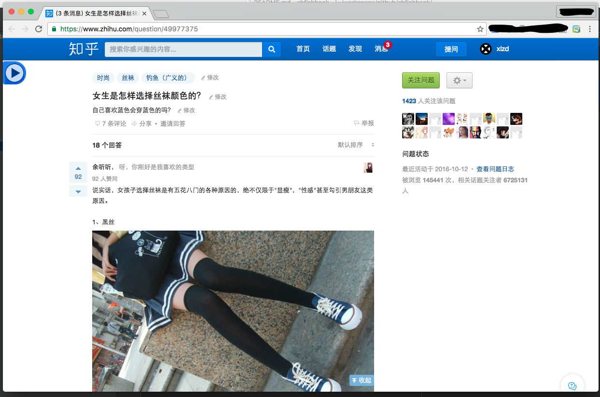
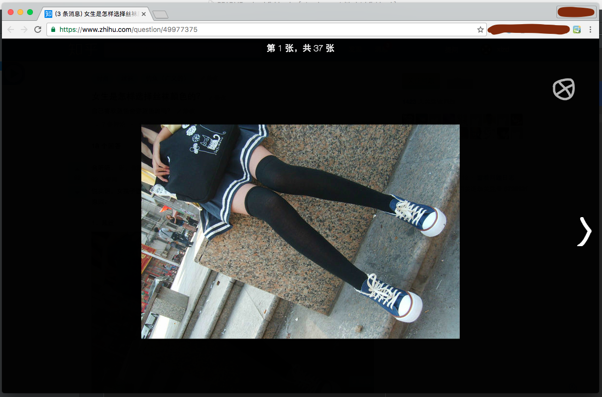
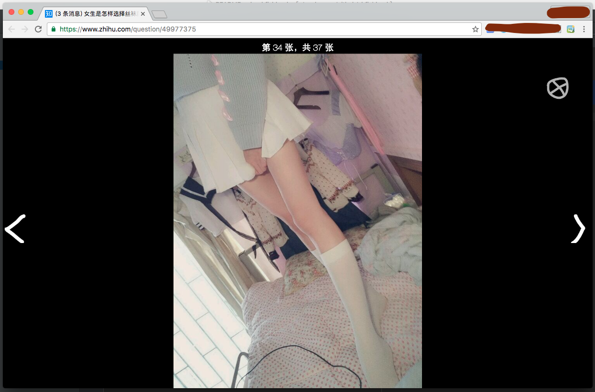

# zhfishhook 知乎鱼钩

---

## 简介

知乎上存在大量钓鱼问题，比如：

 - <a href="" target="_blank">胸大真的自信吗？ - 钓鱼（广义的）</a>
 - <a href="" target="_blank">为什么翘臀那么吸引人，女生如何练翘臀？ - 钓鱼（广义的）</a>
 - <a href="" target="_blank">怎么搭配丝袜优雅不低俗？ - 钓鱼（广义的）</a>
 - ……

这些问题都有大量上钩的鱼爆照，同时也滋生了诸如「轮带逛」、「葡带逛」之类点赞带逛行为。然而，在浏览钓鱼问题的时候，存在一个极不好的体验：**爆照与爆照之间或许间隔着许多文字回答，读图的连贯性被破坏了**。

这个插件旨在解决这个问题，当打开一个有图片的知乎问题页面时，左上角会显示如下按钮：

当按下按钮之后，页面则会变成如下效果：

继续翻页：

---

## 快捷键

如果通过键盘操作，则有以下快捷键：

| 按键 | 作用 | 
|---|---| 
| `s` | 进入或退出图片浏览模式 |
| `esc` | 退出图片浏览模式 |
| `↑`  `←`  | 上一张图片 |
| `↓`  `→`  | 下一张图片 |

---

## 插件下载

下载链接：<a href="https://raw.githubusercontent.com/xlzd/zhfishhook/master/release/zhfishhook.crx" target="_blank">https://raw.githubusercontent.com/xlzd/zhfishhook/master/release/zhfishhook.crx</a>

安装请参考之前的知乎专栏：<a href="https://zhuanlan.zhihu.com/p/22107246?refer=xlz-d" target="_blank">「云拉黑」是什么 - xlzd杂谈 - 知乎专栏</a>

---

## 后续功能

 - 自动播放模式
 - 推荐阅读（推荐热门钓鱼问题）
 - 欢迎建议